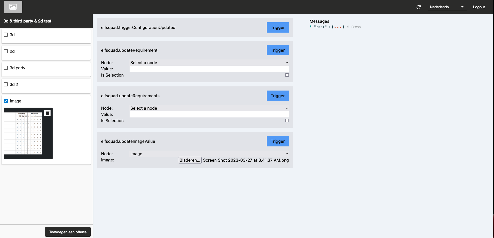

# Third party visualization test



## Instructions

1. Clone the repository, install the dependencies and run the app:
```bash
npm i
npm run start
```

2. Go to the step editor in Elfsquad, set a step to the type third party
   visualization point the third party and point the visualization URL
   to `http://localhost:8001`.

3. Test!

